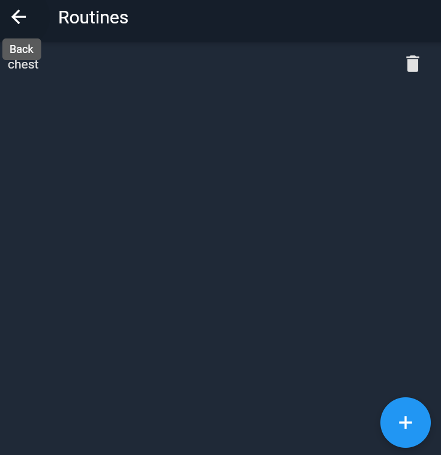
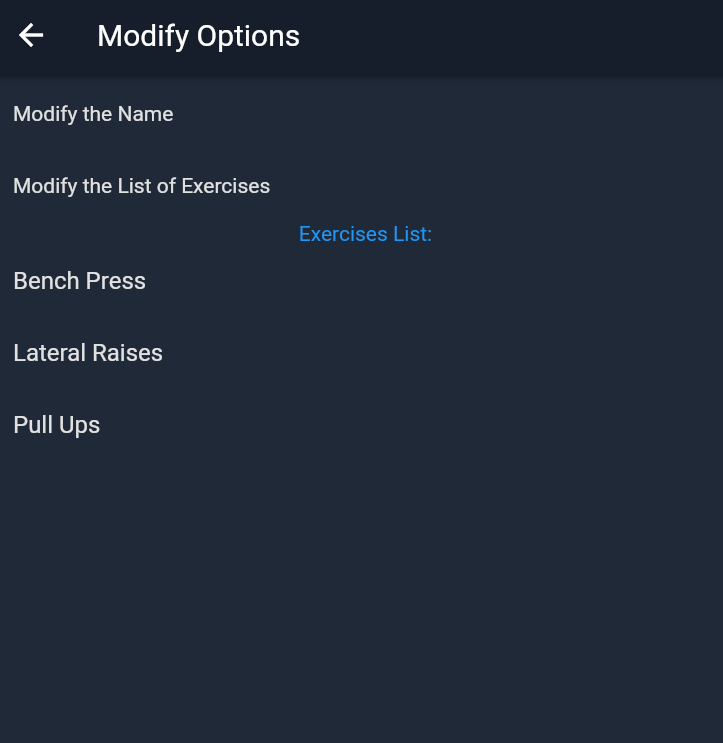
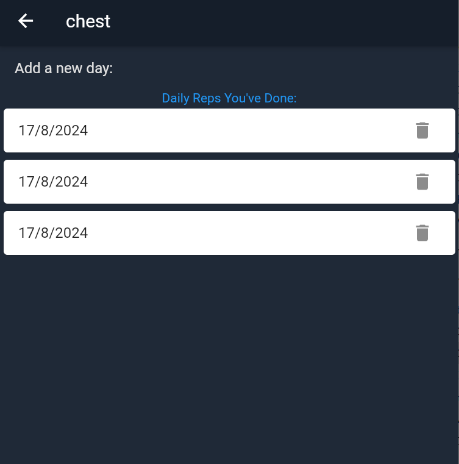
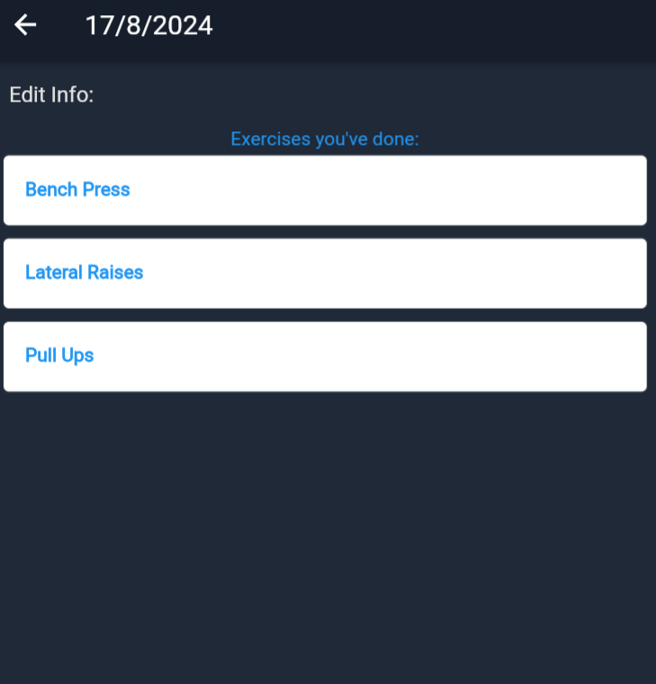
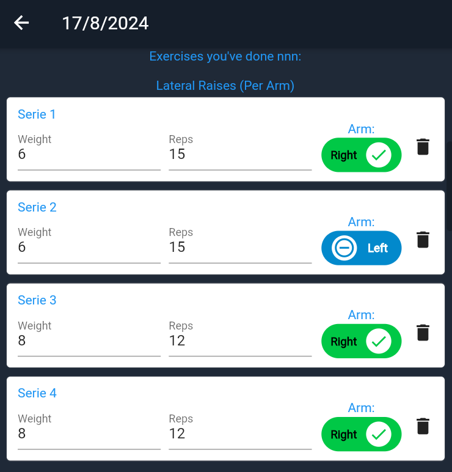
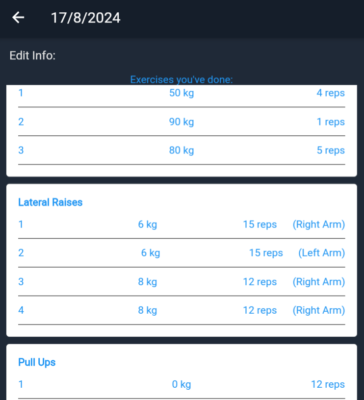
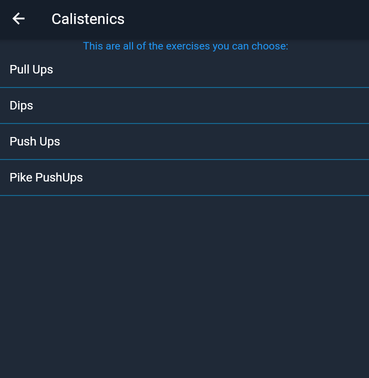
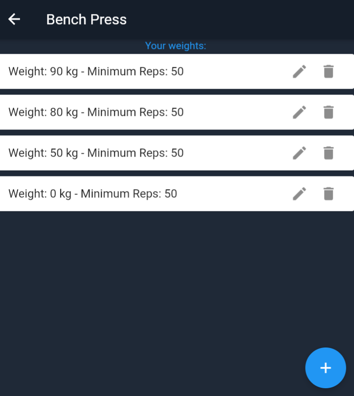
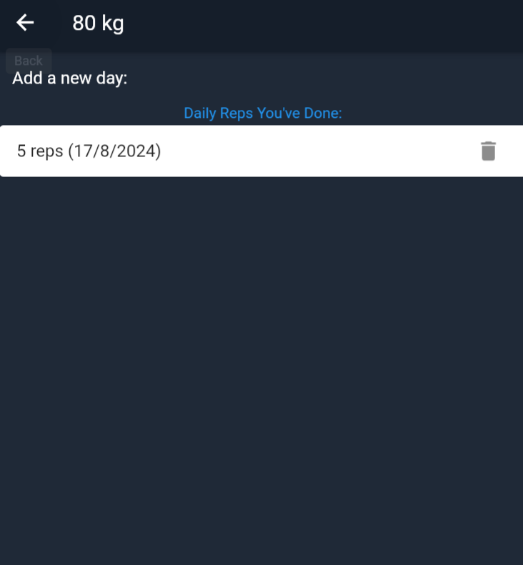
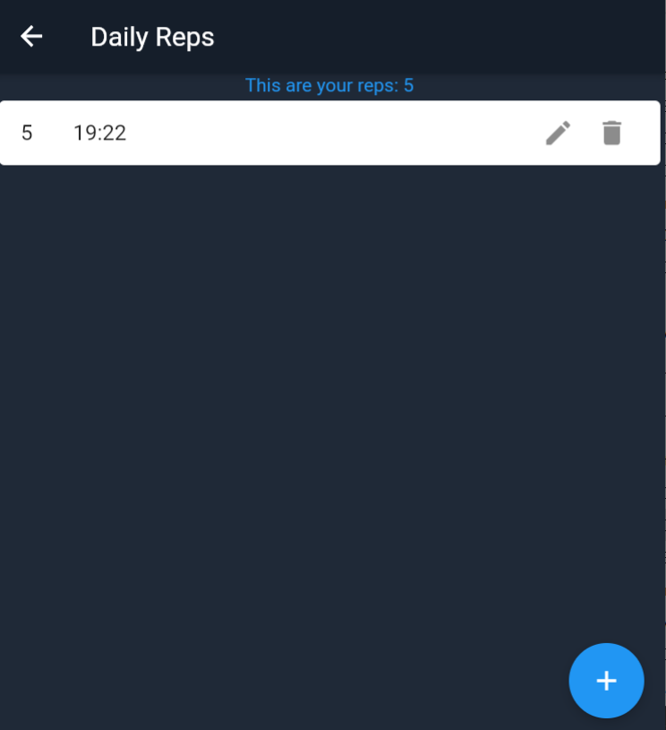

# Gestor de ejercicios de Gym y Calistenia

Este es una aplicación desarrollada en Flutter eficaz para utilizarla cuando vamos a entrenar, sea en el gimnasio o en nuestra casa.

## Gestion de las rutinas

Gestionamos la informacion de las rutinas registradas.

#### Muestra de las rutinas del sistema

Para comenzar con la explicacion creamos una rutina llamada "chest".

#### Gestion de la información de la rutina

En este caso se muestra la informacion de la rutina y se le puede modificar la informacion, tanto el nombre como los ejercicios seleccionados.

## Ejecucion de la rutina

Una vez creada la rutina procedemos a ejecutarla para que tengamos un registro de lo que hacemos cuando entrenamos.

#### Muestra de los dias de la rutina 

Añadimos un nuevo dia y ejecutamos nuestra rutina de ejercicios presionando "Add a new day".

#### Ejecutar la rutina y muestra de la información del dia

Como se puede mostrar solo aparecen los nombres de los ejercicios, 
esto es porque no se ha ejecutado la rutina aún.
Presionamos "Edit info" para ejecutar nuestra rutina.

#### Ejecución de los ejercicios

Ponemos el numero de repeticiones de cada serie en cada ejercicio de la rutina.
Un detalle es que se distingue los ejercicios que se hacen con ambos brazo con los unilaterales 
(de un solo brazo).

#### Muestra de los dias ejecutados en el ejercicio

Después de ejecutar nuestra rutina y ejercicios, se muestra la información guardada.

## Guardado automatico en el historial de reps

Al ejecutar nuestra rutina, toda la información se guardara en la base de datos madre que contiene toda la información de las repeticiones, pesos y dias de los ejercicios.

#### Muestra de los dias ejecutados en el ejercicio

En este caso seleccionamos el ejercicio Bench Press.

#### Muestra de los pesos ejecutados en el ejercicio

Se puede ver que hay 4 pesos registrados y seleccionaremos 80kg.

#### Muestra de los dias ejecutados en el peso seleccionado

Tenemos un dia usando 80kg en Press Banca.

#### Se muestran las repeticiones ejecutadas:

